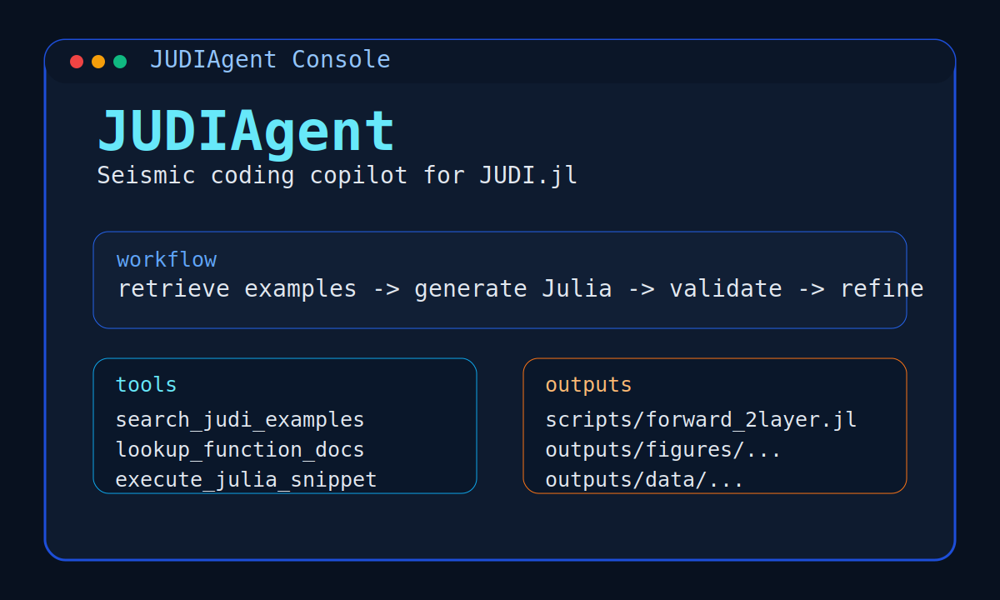
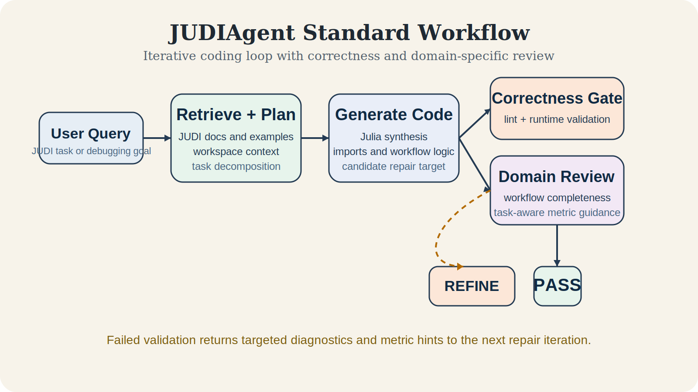
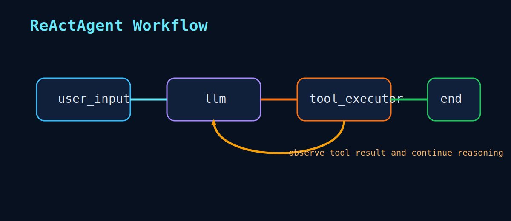

# JUDIAgent

JUDIAgent is a research codebase for generating, validating, and refining
JUDI.jl seismic workflows with large language models. It is designed for cases
where executable Julia is not enough: a useful modeling, imaging, or inversion
script also needs a coherent physical setup, acquisition geometry, operator
composition, and interpretable diagnostics.



## Overview

The agent combines retrieval-augmented generation over JUDI documentation and
examples with a two-part validation loop:

1. executable correctness checks for Julia syntax, lint/runtime failures, and
   expected output artifacts;
2. JUDI-specific domain review for workflow completeness in modeling, RTM, FWI,
   and related seismic tasks.

**Key Features**
- Retrieval-grounded Julia generation using JUDI.jl documentation and examples
- Dual validation: software correctness plus seismic workflow adequacy
- Task-aware metric guidance for benchmark prompts and repair feedback
- Standard iterative and autonomous ReAct-style agent variants
- CLI and LangGraph/MCP integration paths

For public-release provenance and third-party corpus notes, see
[NOTICE](NOTICE) and [src/judiagent/rag/THIRD_PARTY.md](src/judiagent/rag/THIRD_PARTY.md).

## Getting Started

### Requirements

- Python 3.12 or newer
- Julia 1.11.x
- `uv` for reproducible Python environments
- `graphviz` system libraries when building graph visualization dependencies
- Optional: `ollama` for local model experiments

### Local Workstation Setup

```bash
git clone https://github.com/haoyunl2/JUDIAgent.git
cd JUDIAgent
uv venv
source .venv/bin/activate
uv sync
source env/desktop-local.sh
cp .env.example .env
julia --project=. -e 'import Pkg; Pkg.instantiate()'
uv run pytest tests/integration_tests/test_entrypoints.py
```

If you prefer to use your global Julia depot on a personal machine, skip
`source env/desktop-local.sh`.

### Shared Cluster Setup

For PACE or another login-node plus compute-node environment, keep git, editing,
`uv sync`, and import smoke tests on the login node:

```bash
git clone https://github.com/haoyunl2/JUDIAgent.git
cd JUDIAgent
uv venv
source .venv/bin/activate
uv sync
source env/pace-local.sh
cp .env.example .env
uv run pytest tests/integration_tests/test_entrypoints.py
```

Move Julia/JUDI initialization and real agent runs to an interactive allocation:

```bash
salloc ...
srun --pty bash
cd /path/to/JUDIAgent
source .venv/bin/activate
export JUDIAgent_PACE_SHARED_DEPOT=off
source env/pace-local.sh
module load julia/1.11.3
julia --project=. -e 'import Pkg; Pkg.Registry.update(); Pkg.instantiate()'
uv run python examples/agent.py
```

More cluster-specific guidance is in [docs/devel-pace.md](docs/devel-pace.md).

### Environment Variables

Create `.env` from the template and fill only the providers you use:

```bash
cp .env.example .env
```

- `DEEPSEEK_API_KEY`: needed for the default DeepSeek chat model
- `OPENAI_API_KEY`: needed for the default OpenAI embedding model
- `ANTHROPIC_API_KEY`: needed only for Anthropic model configurations
- `LANGSMITH_API_KEY`: optional, for tracing or GUI/debugging workflows
- `EDITOR`: CLI editor used during human review steps

The agent creates `scripts/`, `outputs/figures/`, and `outputs/data/` when it
saves generated code or artifacts. These are runtime outputs and are ignored by
git.

### Verification

```bash
uv run pytest tests/integration_tests/test_entrypoints.py
uv run pytest
```

For a full reproducibility checklist, see
[docs/reproducibility.md](docs/reproducibility.md).

## Usage

JUDIAgent provides two agent variants optimized for different use cases:

### Standard Agent

The standard agent follows a staged scientific coding workflow where code is first generated, then checked for technical correctness, and finally reviewed for JUDI-specific scientific completeness when the task looks like imaging or inversion. Recommended for smaller models or specific tasks like simulation setup.



```bash
uv run python examples/agent.py
```

### Autonomous Agent

The autonomous agent has extended tool access and can interact with the environment more freely. Provides a Copilot-like experience with sufficiently capable LLMs.



```bash
uv run python examples/autonomous_agent.py
```

## Configuration

Static defaults live in `src/judiagent/settings.py`; LangGraph runtime options
are defined in `src/judiagent/configuration.py`.

```python
# Core settings
cli_mode: bool = True  # Enable CLI interface

# Model selection
LOCAL_MODELS = False  # Use local Ollama models instead of remote providers
LLM_MODEL_NAME = "ollama:qwen2.5:7b" if LOCAL_MODELS else "deepseek:deepseek-chat"
EMBEDDING_MODEL_NAME = (
    "ollama:nomic-embed-text" if LOCAL_MODELS else "openai:text-embedding-3-small"
)
```

### Advanced Configuration

The `BaseConfiguration` class provides additional runtime settings:

| Parameter | Description |
|-----------|-------------|
| `human_interaction` | Enable human-in-the-loop controls |
| `embedding_model` | Embedding model for RAG |
| `retriever_provider` | Vector store backend (chroma/faiss) |
| `examples_search_type` | Search strategy (similarity/mmr) |
| `examples_search_kwargs` | Search parameters (k, fetch_k, etc.) |
| `agent_model` | LLM for code generation |
| `agent_prompt` | System prompt for the agent |

## Interfaces

### CLI Mode

Enable CLI mode in `src/judiagent/configuration.py`:

```python
cli_mode = True
```

The CLI provides an interactive interface for:
- Asking questions about JUDI.jl
- Generating and validating code
- Reading and writing files

### VSCode Integration (MCP)

For VSCode integration via Model Context Protocol:

1. Set configuration:
```python
cli_mode = False
mcp_mode = True
```

2. Start the LangGraph server:
```bash
source .venv/bin/activate
langgraph dev
```

3. Configure VSCode with an MCP server (see `.vscode.example/mcp.json`)

### GUI

GUI support is optional and depends on the companion frontend used in your
deployment. The public repository documents the backend LangGraph/MCP surface;
frontend setup should be documented in the GUI repository that consumes it.

## Project Structure

```
JUDIAgent/
├── src/judiagent/
│   ├── agents/            # Agent variants and workflow graphs
│   ├── cli/               # Console views, menus, branding, streaming
│   ├── core/              # Shared runtime helpers
│   ├── julia/             # Python-Julia execution bridge
│   ├── nodes/             # Validation and graph nodes
│   ├── prompting/         # Prompt components and prompt composition
│   ├── rag/               # Retrieval and JUDI source material
│   ├── tools/             # Tool surface exposed to the agents
│   └── configuration.py   # Runtime settings
├── media/                 # README assets
├── benchmarks/            # Prompt catalog and acceptance criteria
├── code_summary/          # Paper-facing notes and generated figure assets
├── docs/                  # Development and reproducibility guides
├── examples/              # Launch scripts
├── judiagent_tutorial/    # Tutorial materials
└── tests/                 # Test suite
```

## Reproducibility

The public release path is documented in
[docs/reproducibility.md](docs/reproducibility.md). Benchmark prompts are in
`benchmarks/prompts.yaml` and can be loaded with `judiagent.benchmarks`;
generated run scripts and artifacts belong in
`scripts/` and `outputs/`, which are intentionally ignored by git.

Retrieval indexes are also built locally on first use under
`src/judiagent/rag/retriever_store/` and `src/judiagent/rag/loaded_store/`.
With the default remote embedding model, that first build requires
`OPENAI_API_KEY`.

## Third-Party Material

The agent implementation is in `src/judiagent/`. Retrieval corpora under
`src/judiagent/rag/judi/` include third-party JUDI.jl documentation and examples
used for grounding. See [NOTICE](NOTICE) and
[src/judiagent/rag/THIRD_PARTY.md](src/judiagent/rag/THIRD_PARTY.md) before
redistributing archival bundles or DOI releases.

## Testing

Tests use [pytest](https://docs.pytest.org/en/stable/):

```bash
uv run pytest
```

## License

The JUDIAgent code is distributed under the MIT License; see
[LICENSE](LICENSE). Third-party retrieval material keeps its upstream notices
and license terms.

## Acknowledgments

- [JUDI.jl](https://github.com/slimgroup/JUDI.jl) for the seismic modeling and inversion API targeted by this project
- [Devito](https://www.devitoproject.org/) for the finite-difference engine used by JUDI
- [LangGraph](https://github.com/langchain-ai/langgraph) for graph-based agent orchestration
- [JutulGPT](https://github.com/SINTEF-agentlab/JutulGPT) for early inspiration and scaffolding of the original coding-agent framing
