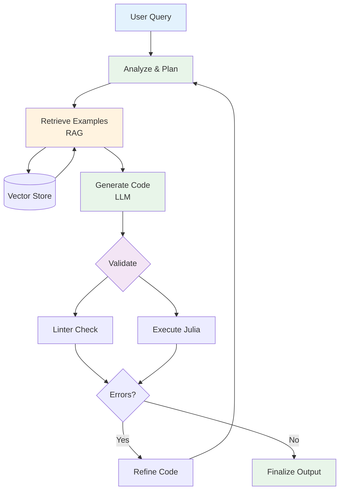

# Figure: Agent Workflow Diagram

**Filename:** `agent_workflow.png`

## Description

This figure should illustrate the complete decision-making workflow of the JUDIAgent system, showing how the agent processes user requests and generates validated code.

## Visual Elements

### Layout
- **Flow direction:** Top-to-bottom or left-to-right
- **Style:** Modern flowchart with rounded rectangles and connecting arrows
- **Color scheme:** 
  - Blue: User/Input nodes
  - Green: Agent reasoning nodes
  - Orange: Tool execution nodes
  - Purple: Validation nodes
  - Gray: Decision diamonds

### Components to Include

```
┌─────────────────────────────────────────────────────────────────────┐
│                        JUDIAGENT WORKFLOW                            │
├─────────────────────────────────────────────────────────────────────┤
│                                                                      │
│    ┌──────────────┐                                                 │
│    │  User Query  │  "Create a 2D seismic modeling example"         │
│    │  (Natural    │                                                 │
│    │   Language)  │                                                 │
│    └──────┬───────┘                                                 │
│           │                                                          │
│           ▼                                                          │
│    ┌──────────────┐                                                 │
│    │   ANALYZE    │  Parse requirements, identify JUDI components   │
│    │   & PLAN     │  needed (Model, Geometry, Operator)             │
│    └──────┬───────┘                                                 │
│           │                                                          │
│           ▼                                                          │
│    ┌──────────────┐     ┌─────────────────────────────────┐         │
│    │   RETRIEVE   │────▶│  Vector Store (ChromaDB/FAISS)  │         │
│    │   EXAMPLES   │◀────│  - JUDI.jl examples             │         │
│    │   (RAG)      │     │  - Documentation chunks         │         │
│    └──────┬───────┘     └─────────────────────────────────┘         │
│           │                                                          │
│           ▼                                                          │
│    ┌──────────────┐                                                 │
│    │   GENERATE   │  LLM produces Julia code based on               │
│    │   CODE       │  retrieved examples + task description          │
│    │   (LLM)      │                                                 │
│    └──────┬───────┘                                                 │
│           │                                                          │
│           ▼                                                          │
│    ┌──────────────┐                                                 │
│    │   VALIDATE   │                                                 │
│    │   CODE       │                                                 │
│    └──────┬───────┘                                                 │
│           │                                                          │
│     ┌─────┴─────┐                                                   │
│     ▼           ▼                                                   │
│  ┌──────┐   ┌──────────┐                                            │
│  │Linter│   │ Execute  │                                            │
│  │Check │   │ Julia    │                                            │
│  └──┬───┘   └────┬─────┘                                            │
│     │            │                                                   │
│     └─────┬──────┘                                                  │
│           │                                                          │
│           ▼                                                          │
│      ◇─────────◇                                                    │
│     ╱  Errors?  ╲                                                   │
│    ╱             ╲                                                  │
│   Yes             No                                                │
│    │               │                                                │
│    ▼               ▼                                                │
│  ┌─────────┐   ┌──────────┐                                         │
│  │ REFINE  │   │ FINALIZE │                                         │
│  │ (loop)  │   │ (output) │                                         │
│  └────┬────┘   └──────────┘                                         │
│       │                                                              │
│       └────────────────────────────────────────────────▶ ANALYZE    │
│                                                                      │
└─────────────────────────────────────────────────────────────────────┘
```

### Annotations

1. **User Query Box:** Show example natural language input
2. **Analyze & Plan:** Highlight the reasoning step
3. **RAG Box:** Show connection to vector store with example queries
4. **LLM Box:** Indicate model (GPT-4.1 / Ollama)
5. **Validation Split:** Show parallel linter + execution
6. **Error Feedback Loop:** Emphasize iterative refinement

### Style Guidelines

- Use icons for different node types (brain for reasoning, code brackets for generation, checkmark for validation)
- Include timing annotations (e.g., "~2-5s" for LLM inference)
- Show tool names next to execution nodes
- Use dashed lines for optional paths (human-in-the-loop)

## Suggested Tools

- **draw.io / diagrams.net** for editable diagrams
- **Mermaid** for code-based diagrams
- **Lucidchart** for polished presentation
- **TikZ** for LaTeX integration

## Mermaid Code (Alternative)



